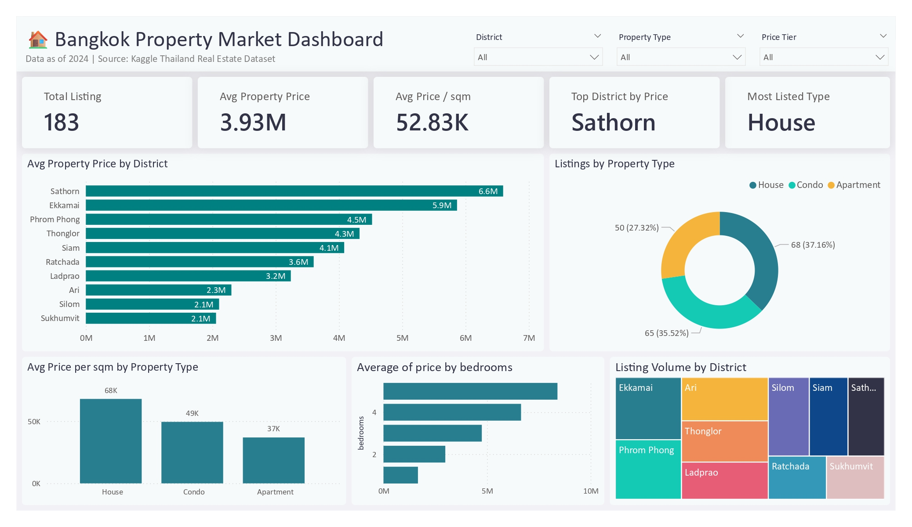

# 🏠 Bangkok Property Market Analytics Pipeline

## Overview
End-to-end data engineering pipeline ingesting Bangkok property listings,
transforming through a structured ETL process, and delivering a Power BI
dashboard showing market trends by district, property type, and price tier.

## Architecture
```
Raw CSV → Python ETL → PostgreSQL → Power BI Dashboard
              ↑
         Apache Airflow (orchestration)
```

## Stack
| Layer | Technology |
|-------|-----------|
| Ingestion | Python, Pandas |
| Orchestration | Apache Airflow |
| Storage | PostgreSQL (Docker) |
| Visualization | Power BI |
| Infrastructure | Docker, Docker Compose |

## Key Findings
- 563 raw listings → 183 clean records after deduplication and validation
- Mid-range properties (2M–5M THB) make up 50% of the market
- Condos dominate Bangkok listings

## How to Run
### Prerequisites
- Python 3.11+
- Docker Desktop
- Power BI Desktop

### Steps
```bash
git clone https://github.com/STMM-Hub/data-engineering-portfolio
cd 01-bangkok-property-pipeline
cp .env.example .env
python -m venv venv
venv\Scripts\activate
pip install -r requirements.txt
docker-compose up -d
python pipeline.py
```

## Project Structure
```
01-bangkok-property-pipeline/
├── dags/                    # Airflow DAG definitions
├── ingestion/               # Data extraction scripts
├── transformation/          # Transform and load scripts
├── sql/                     # Database schema
├── dashboard/               # Power BI file
├── data/                    # Raw data (gitignored)
├── pipeline.py              # Manual pipeline runner
├── docker-compose.yml       # Docker services
└── requirements.txt         # Python dependencies
```

## Dashboard Preview
