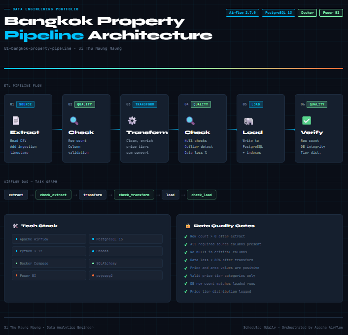

# 🏙️ Bangkok Property Market ETL Pipeline

An end-to-end data engineering project that extracts, transforms, and loads Bangkok property listing data into PostgreSQL using Apache Airflow, with a Power BI dashboard for visualization.

---

## 📊 Dashboard Preview


---

## 🏗️ Architecture



---

## 🛠️ Tech Stack

| Layer | Tool |
|---|---|
| Orchestration | Apache Airflow 2.7.0 |
| Language | Python 3.12 |
| Database | PostgreSQL 13 |
| Visualization | Power BI |
| Containerization | Docker & Docker Compose |
| Data Processing | Pandas, SQLAlchemy |

---

## 📁 Project Structure

```
01-bangkok-property-pipeline/
├── architecture/
│   └── dashboard_preview.png       # Power BI dashboard screenshot
├── dags/
│   └── bangkok_property_dag.py     # Airflow DAG with ETL + quality checks
├── dashboard/
│   └── Bangkok Property Dashboard.pbix  # Power BI dashboard file
├── ingestion/
│   └── extract.py                  # CSV extraction logic
├── transformation/
│   ├── transform.py                # Data cleaning and enrichment
│   └── load.py                     # PostgreSQL loading logic
├── sql/
│   └── create_tables.sql           # Table schema and indexes
├── data/
│   └── raw_listings.csv            # Source data
├── Dockerfile                      # Custom Airflow image with dependencies
├── docker-compose.yml              # Multi-container setup
├── requirements.txt                # Python dependencies
└── .env                            # Environment variables (not committed)
```

---

## ⚙️ Pipeline Details

### Extract
- Reads raw property listings from CSV
- Adds `ingestion_date` timestamp metadata

### Transform
- Standardizes column names
- Converts area from sq ft to sq meters
- Removes nulls, duplicates, and outliers
- Calculates `price_per_sqm`
- Categorizes listings into price tiers:
  - Budget (< 2M THB)
  - Mid-range (2M - 5M THB)
  - Premium (5M - 10M THB)
  - Luxury (> 10M THB)

### Load
- Creates `property_listings` table with indexes
- Loads cleaned data into PostgreSQL
- Verifies row count after load

### Data Quality Checks
Quality gates run after each stage:

| Check | Stage |
|---|---|
| Row count > 0 | After Extract |
| Required columns present | After Extract |
| No nulls in critical columns | After Transform |
| Data loss < 80% | After Transform |
| Prices and areas are positive | After Transform |
| Valid price tier values | After Transform |
| DB row count matches loaded rows | After Load |
| No nulls in DB critical columns | After Load |

---

## 🚀 Getting Started

### Prerequisites
- Docker Desktop
- Power BI Desktop (for dashboard)

### Setup

**1. Clone the repository**
```bash
git clone https://github.com/yourusername/data-engineering-portfolio.git
cd data-engineering-portfolio/01-bangkok-property-pipeline
```

**2. Create your `.env` file**
```env
POSTGRES_USER=admin
POSTGRES_PASSWORD=admin123
POSTGRES_DB=bangkok_property
POSTGRES_HOST=postgres
POSTGRES_PORT=5432
```

**3. Build and start containers**
```bash
docker-compose build
docker-compose up airflow-init
docker-compose up -d
```

**4. Access Airflow UI**
- URL: http://localhost:8080
- Username: `admin`
- Password: `admin123`

**5. Trigger the DAG**
- Find `bangkok_property_pipeline` in the DAG list
- Click the ▶ button to trigger manually

**6. Connect Power BI**
- Open `dashboard/Bangkok Property Dashboard.pbix`
- Data source: `localhost:5432`, database: `bangkok_property`

---

## 📦 After `docker-compose down`

Packages are baked into the Docker image via `Dockerfile`, so no reinstallation is needed:

```bash
docker-compose up -d
```

---

## 📈 Key Metrics Tracked

- Property listings by district
- Price distribution by property type
- Price per sqm trends
- Price tier breakdown
- Bedroom count analysis

---

## 🔮 Future Improvements

- [ ] Add email alerts on DAG failure
- [ ] Scrape live data from property websites instead of CSV
- [ ] Add dbt for data modeling layer
- [ ] Deploy to cloud (Azure / AWS)
- [ ] Add CI/CD pipeline with GitHub Actions